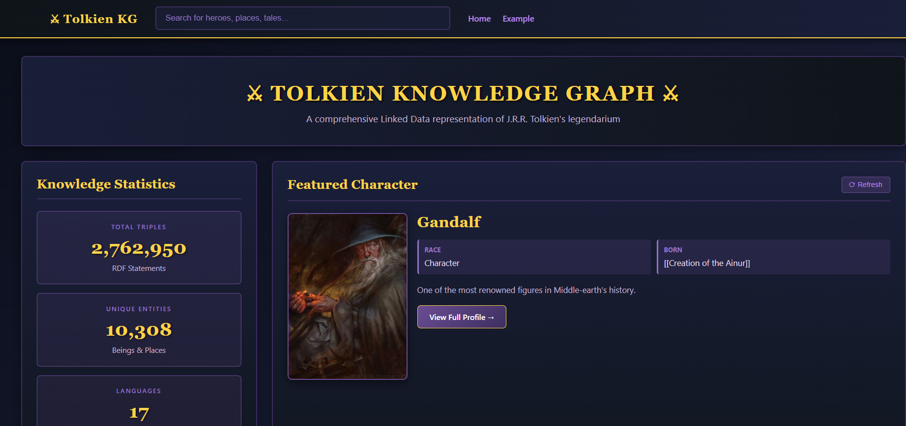
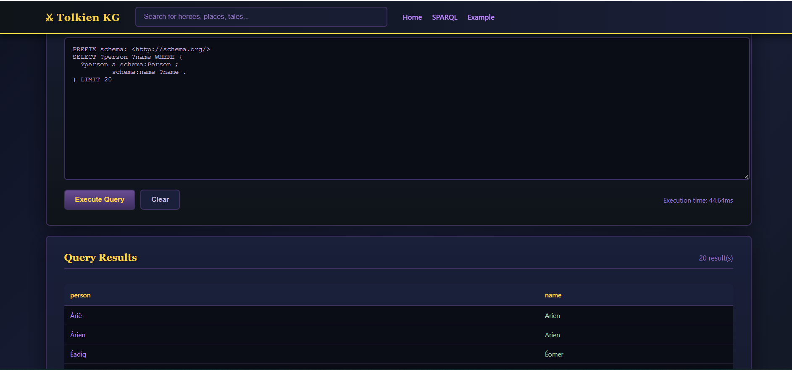
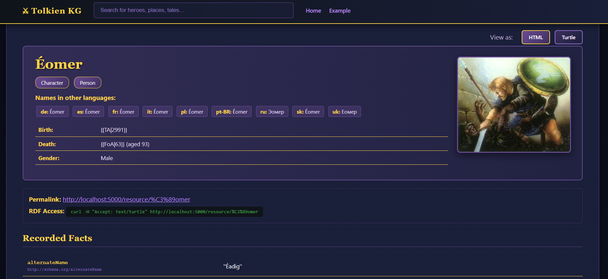
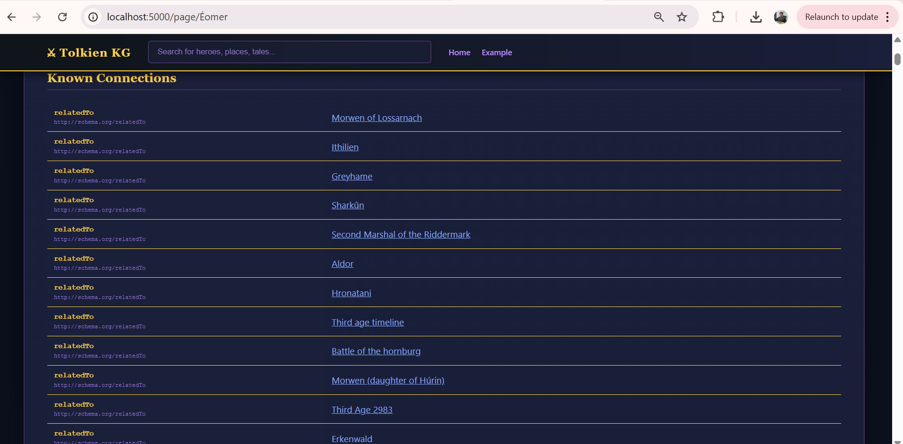

# Tolkien Linked Data Platform

> A comprehensive knowledge graph of J.R.R. Tolkien's Middle-earth built with Semantic Web technologies

[](https://www.python.org/)
[](https://www.w3.org/RDF/)
[](https://flask.palletsprojects.com/)
[](#)

A semantic web project demonstrating practical application of RDF, SPARQL, OWL reasoning, and Linked Data principles. Integrates multiple data sources about Tolkien's legendarium into a unified knowledge graph with proper Linked Data architecture.

---

## Table of Contents

- [About](#about)
- [Screenshots](#screenshots)
- [Features](#features)
- [Data Sources](#data-sources)
- [Tech Stack](#tech-stack)
- [Getting Started](#getting-started)
- [Project Structure](#project-structure)
- [Usage Examples](#usage-examples)
- [Academic Context](#academic-context)
- [License](#license)
- [Acknowledgments](#acknowledgments)

---

## About

This project creates a rich, interconnected semantic dataset of Tolkien's Middle-earth mythology following W3C Linked Data best practices. The platform processes multiple data sources and implements a complete Linked Data ecosystem with Apache Jena Fuseki and Flask.

**Key Implementations:**
- Proper Linked Data architecture with URI design, 303 redirects, and content negotiation
- OWL reasoning engine that materializes implicit knowledge from explicit statements
- External integration with DBpedia and Wikidata through owl:sameAs links
- SHACL validation for data quality enforcement
- SPARQL endpoint for complex queries across the knowledge graph
- Multilingual label support from multiple Tolkien wikis

---

## Screenshots

<table>
  <tr>
    <td width="50%">
      
      <p align="center"><i>Home Page</i></p>
    </td>
    <td width="50%">
      
      <p align="center"><i>Search Result</i></p>
    </td>
  </tr>
  <tr>
    <td width="50%">
      
      <p align="center"><i>Entity</i></p>
    </td>
    <td width="50%">
      
      <p align="center"><i>Link Data</i></p>
    </td>
  </tr>
</table>

---

## Features

**Linked Data Implementation:**
- Separate `/resource/` and `/page/` URI patterns with proper 303 redirects
- Content negotiation serving HTML for humans and RDF/Turtle for machines
- SPARQL endpoint for querying the complete knowledge graph
- Integration with external knowledge graphs (DBpedia, Wikidata)

**Semantic Technologies:**
- OWL reasoning automatically infers relationships (symmetric properties, inverse properties, transitive chains)
- SHACL validation enforces data quality constraints
- schema.org vocabulary for consistent semantic modeling
- RDF representation in Turtle format

**Data Integration:**
- Wiki content extraction and RDF conversion
- Trading card metadata alignment with canonical entities
- Character datasets enrichment
- Multilingual labels from multiple wiki sources

---

## Data Sources

The knowledge graph integrates four primary data sources:

**Tolkien Gateway Wiki**
- Comprehensive wiki articles about Middle-earth
- Extracted via MediaWiki API
- Infobox templates converted to RDF triples

**LOTR Characters Dataset (CSV)**
- Structured character information
- Biographical details and relationships
- Enriches wiki data with additional attributes

**Middle-earth Collectible Card Game (MECCG)**
- Trading card metadata in JSON format
- Links canonical entities to their card representations
- Includes both authentic and game-invented entities

**Multilingual Tolkien Wiki**
- Labels in multiple languages
- Enables internationalization of entity names
- Provides cross-linguistic entity alignment

---

## Tech Stack

**Triplestore & Reasoning:**
- Apache Jena Fuseki - RDF storage and SPARQL endpoint
- OWL-RL - Reasoning engine for inference

**Python Stack:**
- Flask - Linked Data web interface
- RDFLib - RDF graph processing
- pySHACL - SHACL validation
- SPARQLWrapper - SPARQL query execution
- Pandas - Data processing

**Data Extraction:**
- MediaWiki API client (mwclient)
- WikiTextParser - Template parsing
- BeautifulSoup4 - HTML processing

**Vocabularies:**
- schema.org (primary modeling vocabulary)
- OWL (reasoning and inference)
- SHACL (validation constraints)

---

## Getting Started

### Prerequisites

- Python 3.8 or higher
- Java 11+ (for Apache Jena Fuseki)
- Git

### Installation

**1. Clone the repository**

```bash
git clone https://github.com/yourusername/tolkien-linked-data-platform.git
cd tolkien-linked-data-platform
```

**2. Create virtual environment**

```bash
# Windows
python -m venv .venv
.\.venv\Scripts\Activate.ps1

# Unix/MacOS
python3 -m venv .venv
source .venv/bin/activate
```

**3. Install dependencies**

```bash
pip install -r requirements.txt
```

**4. Setup Apache Jena Fuseki**

Download Fuseki from [Apache Jena website](https://jena.apache.org/download/) and extract.

**5. Install and  Start Fuseki server****

```bash
cd apache-jena-fuseki-5.6.0/
./fuseki-server.bat  # Windows
./fuseki-server      # Unix/MacOS

```

Create  a dataset name as `tolkien` dataset on Fuseki

select Persistent dataset (TDB2)

**6.1 unzip data/tokien_complete.zip

**6.2 Load data/tokien_complete.ttl to Fuseki 

### Load data/tokien_complete to Fuseki 

**7. Start Flask application**

```bash
python src/server.py
```

Visit `http://localhost:5000` to browse the knowledge graph.

---

## Project Structure

```
tolkien-linked-data-platform/
├── src/
│   ├── crawl/              # Wiki scraping and data extraction
│   ├── transform/          # RDF conversion and processing
│   ├── server/             # Flask Linked Data interface
│   ├── external/           # External knowledge graph integration
│   ├── more_data/          # MECCG cards and CSV enrichment
│   ├── align/              # Entity alignment across sources
│   ├── shacl/              # SHACL validation
│   └── templates/          # HTML templates for web interface
├── data/
│   ├── ttl/                # Excluded
│   ├── external/           # owl:sameAs links to DBpedia/Wikidata
│   ├── kg/                 # Merged knowledge graph and SHACL shapes
│   └── cache/              # Excluded
├── configs/                # Configuration files
├── scripts/                # Utility scripts
├── docs/                   # Documentation
├── report/                 # Academic report
├── requirements.txt        # Python dependencies
└── README.md
```

**Note:** The `data/ttl/` and `data/cache/` directories are excluded from version control due to size however the data part you wil find one single ttl file in zip folder, unzip it in same directory and start working further.

---

## Usage Examples

### Browse entities

```
http://localhost:5000/page/Aragorn
http://localhost:5000/page/Rivendell
http://localhost:5000/page/The_One_Ring
```

### SPARQL queries

```sparql
# Find all characters from Gondor
SELECT ?person ?name WHERE {
  ?person a schema:Person ;
          schema:name ?name ;
          schema:birthPlace ?place .
  FILTER(CONTAINS(STR(?place), "Gondor"))
}
```

Execute at: `http://localhost:3030/tolkien/query`

### Content negotiation

```bash
# Request RDF representation
curl -H "Accept: text/turtle" http://localhost:5000/resource/Aragorn

# Request HTML representation
curl -H "Accept: text/html" http://localhost:5000/resource/Aragorn
```


### Run SHACL validation

```bash
python src/shacl/validate_shapes.py
```

Outputs validation report to `chacle_report/shacl_report.txt`.

---


## Academic Context

**Course:** Semantic Web Technologies  
**Institution:** École des Mines de Saint-Étienne  
**Instructor:** Antoine Zimmermann & Victor Charpenay 
**Submission:** January 2026

**Demonstrated Competencies:**
- RDF data modeling with schema.org vocabulary
- SPARQL query optimization for large datasets
- Linked Data architecture (URI design, 303 redirects, content negotiation)
- SHACL constraint validation
- OWL reasoning and knowledge inference
- Integration with external knowledge graphs
- Multi-source data alignment and fusion

---

## License

Academic project for coursework at École des Mines de Saint-Étienne.

**Data Attribution:**
- Tolkien Gateway - CC BY-SA license
- LOTR character data - respective licenses apply
- MECCG card data - game metadata
- External links to DBpedia and Wikidata under their respective licenses

---

## Acknowledgments

- **Antoine Zimmermann & Victor Charpenay** - Course instruction and semantic web guidance
- **Tolkien Gateway community** - Comprehensive wiki content
- **Apache Jena developers** - RDF triplestore and reasoning tools
- **RDFLib maintainers** - Python RDF processing library
- **DBpedia and Wikidata projects** - External knowledge graph integration

---

**Project Maintainer:** Irfan Ullah & Sajid
**Inst**Institution:** École des Mines de Saint-Étienne & University Jean Monnet Saint-Étienne
